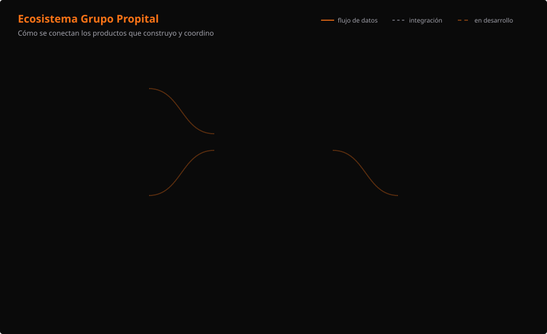
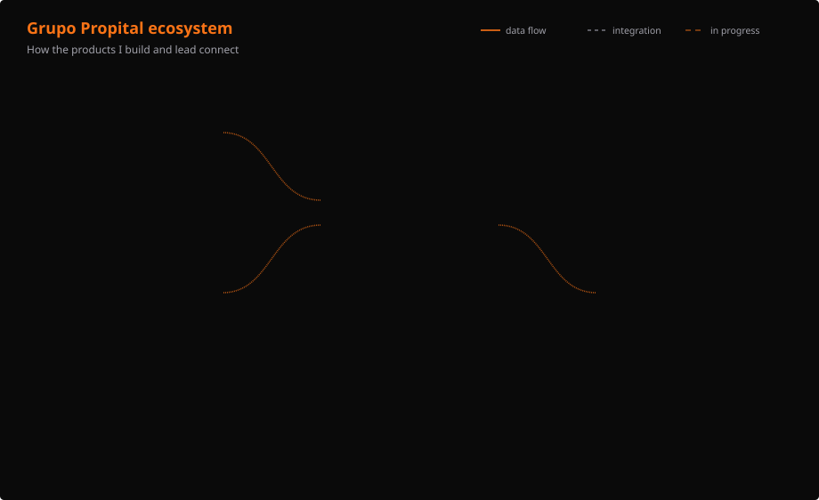

  

  
  
  
  

  <b>🇪🇸 Español</b> · <a href="#-english">🇬🇧 English</a>

---

### 👋 Sobre mí

Head of Product & Operations en **Grupo Propital**, basado en **San Juan, Argentina**. Empecé como developer construyendo sistemas reales apalancado en IA; hoy lidero producto y operaciones combinando estrategia, arquitectura y ejecución técnica. Mi base es **Técnico Electrónico**, con estudios parciales en Tecnicatura Universitaria en Programación (UNSJ).

Coordino **TuMatch/Orkezto** (el CRM inmobiliario multi-marca que diseñé e implementé desde cero, en producción hace más de dos años) y **Numinap**, la app de planificación patrimonial del grupo — diseñé e impulsé la integración cross-producto entre ambas plataformas. También contribuyo con producto e ingeniería en **Propirent** (gestión de propiedades, con una integración propia hacia Numinap) y **Orvyt** (plataforma inmobiliaria multi-tenant para Latinoamérica). En paralelo dirijo **Made In 3D**, mi emprendimiento de manufactura aditiva.

- 🟢 Disponible para conversar sobre producto, tecnología y operaciones · remoto o presencial en San Juan
- 🌐 Portfolio completo en **[matiasaguero.dev](https://www.matiasaguero.dev/)**
- 🗣️ Español (nativo) · English (B1)

**🎓 Estudios**
- Técnico Electrónico
- Tecnicatura Universitaria en Programación — UNSJ _(parcial)_
- Formación autodidacta apalancada en IA

**💼 Qué hago**
- Producto y operaciones multi-producto (TuMatch/Orkezto, Numinap, Propirent & Orvyt)
- Arquitectura, integraciones y decisiones técnicas (Next.js · TypeScript · Supabase · APIs REST)
- Coordinación ejecutiva, financiera y legal en proptech

---

### 🚀 Software que construyo

  

**🏢 CRM TuMatch & Orkezto** · _en producción_
Sistema CRM corporativo multi-marca que diseñé e implementé desde cero para una proptech chilena. Centraliza toda la operación comercial de una red de corredores: gestión de leads, propiedades, cobranzas y membresías. Integra seis plataformas externas vía APIs REST.
`Next.js` · `TypeScript` · `Supabase` · `PostgreSQL` · `Python` · `APIs REST`

**🔗 Integraciones Numinap** · _en producción_
Diseñé e impulsé las integraciones que conectan Numinap (planificación patrimonial) con el resto del ecosistema: un corredor de TuMatch/Orkezto comparte su link de referido con clientes, y Propirent emite automáticamente el flujo de caja de las propiedades administradas hacia el patrimonio del inversionista en Numinap.
`Next.js` · `Supabase` · `APIs REST` · `Product Strategy`

**🏘️ Orvyt** · _en producción_
Plataforma inmobiliaria multi-tenant para Latinoamérica. Contribuí integraciones de pago (MercadoPago, Stripe), mensajería (Twilio WhatsApp/SMS), un módulo de postventa (tickets, entregas, garantías) y dark mode completo para el CRM.
`Next.js` · `TypeScript` · `Supabase` · `Stripe` · `MercadoPago`

**🌐 [TuMatch Web](https://web-sepia-beta-83.vercel.app/)** · _público_
Sitio web institucional de la proptech, construido con stack moderno.
`Next.js` · `TypeScript` → [repo](https://github.com/matias-aguero-ventrice/tumatch-web)

**📐 [Rental Profitability Analyzer](https://github.com/matias-aguero-ventrice/rental-profitability-analyzer)** · _público_
Herramienta que calcula la rentabilidad de propiedades en arriendo y genera reportes en PDF con firma digital. Documentado con guía de setup y configuración.
`TypeScript` · `Generación de PDF` · `Firma digital`

**🧩 [Sistema de asignaciones](https://listadopropiedades.vercel.app/)** · _demo en vivo_
Plataforma para asignar y coordinar corredores freelance y listar propiedades.
`Web App` · [repo](https://github.com/matias-aguero-ventrice/tumatch-asignaciones)

**📝 [Certificación de corredores](https://examen-certificacion-corredor.vercel.app/)** · _demo en vivo_
Sistema de evaluación online para certificar corredores inmobiliarios.
`Web App` · [repo](https://github.com/matias-aguero-ventrice/examen-certificacion-corredor)

**🏪 [MiSUPER](https://mi-super-nine.vercel.app/)** · _demo en vivo_
Sistema de gestión para kioscos y comercios minoristas: ventas, control de stock e inventario.
`Next.js` · `TypeScript` · `Supabase`

**🌐 [Portfolio personal](https://www.matiasaguero.dev/)** · _open source_
El sitio que ves en matiasaguero.dev. Mobile-first, Lighthouse >95, con chatbot IA, command palette (`Ctrl K`), modo presentación, soporte bilingüe ES/EN, generación de vCard + QR y animaciones con Framer Motion.
`Next.js 15` · `TypeScript` · `Tailwind` · `Framer Motion` · `Cal.com` → [repo](https://github.com/matias-aguero-ventrice/portfolio)

---

### 🛠️ Stack técnico

**Frontend**

**Backend & Datos**

**Herramientas**

**IA & Productividad**

---

### 📊 GitHub Stats

  
   
   
  
  

---
 

## 🇬🇧 English

  <a href="#-sobre-mí">🇪🇸 Español</a> · <b>🇬🇧 English</b>

### 👋 About me

Head of Product & Operations at **Grupo Propital**, based in **San Juan, Argentina**. I started out as a developer building real systems leveraging AI tools; today I lead product and operations, combining strategy, architecture, and hands-on execution. My foundation is **Electronics Technician**, with partial studies in a University Programming degree (UNSJ).

I coordinate **TuMatch/Orkezto** (the multi-brand real-estate CRM I designed and built from scratch, in production for over two years) and **Numinap**, the group's wealth-planning app — I designed and drove the cross-product integration between both platforms. I also contribute product and engineering work on **Propirent** (property management, with its own integration into Numinap) and **Orvyt** (a multi-tenant real-estate platform for Latin America). In parallel I run **Made In 3D**, my additive-manufacturing venture.

- 🟢 Open to conversations about product, technology, and operations · remote or on-site in San Juan
- 🌐 Full portfolio at **[matiasaguero.dev](https://www.matiasaguero.dev/)**
- 🗣️ Spanish (native) · English (B1)

**🎓 Education**
- Electronics Technician
- University Programming degree — UNSJ _(partial)_
- Self-taught, leveraging AI tools

**💼 What I do**
- Multi-product product & operations leadership (TuMatch/Orkezto, Numinap, Propirent & Orvyt)
- Architecture, integrations, and technical decisions (Next.js · TypeScript · Supabase · REST APIs)
- Executive, financial, and legal coordination in proptech

### 🚀 Software I build

  

**🏢 TuMatch & Orkezto CRM** · _in production_ — Multi-brand corporate CRM built from scratch for a Chilean proptech. Centralizes the full commercial operation of a brokerage network (leads, properties, billing, memberships) and integrates six external platforms via REST APIs. `Next.js` · `TypeScript` · `Supabase` · `Python`

**🔗 Numinap integrations** · _in production_ — I designed and drove the integrations connecting Numinap (wealth planning) to the rest of the ecosystem: a TuMatch/Orkezto broker shares their referral link with clients, and Propirent automatically emits the cash flow of managed properties into the investor's net worth in Numinap. `Next.js` · `Supabase` · `APIs REST`

**🏘️ Orvyt** · _in production_ — Multi-tenant real-estate platform for Latin America. I contributed payment integrations (MercadoPago, Stripe), messaging (Twilio WhatsApp/SMS), an after-sales module (tickets, deliveries, warranties), and a full dark mode for the CRM. `Next.js` · `TypeScript` · `Supabase` · `Stripe` · `MercadoPago`

**🌐 [TuMatch Web](https://web-sepia-beta-83.vercel.app/)** · _public_ — Institutional website for the proptech. `Next.js` · `TypeScript`

**📐 [Rental Profitability Analyzer](https://github.com/matias-aguero-ventrice/rental-profitability-analyzer)** · _public_ — Tool that computes rental property profitability and generates PDF reports with digital signature. `TypeScript` · `PDF` · `Digital signature`

**🧩 [Broker assignment system](https://listadopropiedades.vercel.app/)** · _live demo_ — Platform to assign and coordinate freelance brokers and list properties.

**📝 [Broker certification](https://examen-certificacion-corredor.vercel.app/)** · _live demo_ — Online assessment system to certify real-estate brokers.

**🏪 [MiSUPER](https://mi-super-nine.vercel.app/)** · _live demo_ — Management system for kiosks and retail stores: sales, stock and inventory. `Next.js` · `TypeScript` · `Supabase`

**🌐 [Personal portfolio](https://www.matiasaguero.dev/)** · _open source_ — The site at matiasaguero.dev. Mobile-first, Lighthouse >95, AI chatbot, command palette, presentation mode, ES/EN i18n, vCard + QR generation, Framer Motion animations. `Next.js 15` · `TypeScript` · `Tailwind`

  <i>Respondo todos los mensajes en menos de 24 horas · I reply to every message within 24 hours.</i> 
  <a href="https://www.matiasaguero.dev/">matiasaguero.dev</a>

