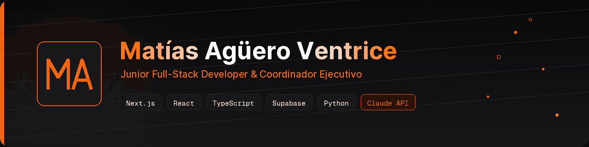
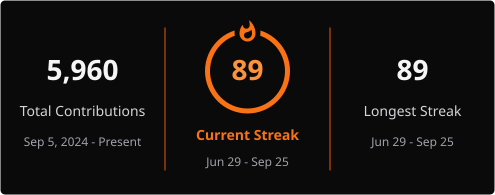

  

  
  

  <b>🇪🇸 Español</b> · <a href="#-english">🇬🇧 English</a>

---

### 👋 Sobre mí

Head of Product & Operations en **Grupo Propital**, desde **San Juan, Argentina**. Empecé como developer construyendo sistemas reales con IA; hoy lidero producto y operaciones de todo el grupo, combinando estrategia, arquitectura y ejecución técnica.

Diseñé desde cero el CRM que opera **TuMatch/Orkezto** (en producción hace más de dos años) y las integraciones que conectan el ecosistema con **Numinap**. En paralelo dirijo **Made In 3D**, mi emprendimiento de manufactura aditiva.

**💼 Qué hago**
- Producto y operaciones de TuMatch/Orkezto, Numinap, Propital, Propirent y Orvyt
- Arquitectura, integraciones y decisiones técnicas
- Coordinación ejecutiva, financiera y legal en proptech

🎓 Técnico Electrónico · Tecnicatura en Programación, UNSJ _(parcial)_ 
🗣️ Español nativo · English B1 
🟢 Disponible para conversar sobre producto, tecnología y operaciones

---

### 📈 Impacto

  

---

### 🚀 Software que construyo

  

- **🏢 CRM TuMatch & Orkezto** · _en producción_ — CRM white-label multi-marca que diseñé desde cero: leads, propiedades, cobranzas y membresías de toda la red, con seis integraciones externas. `Next.js` · `TypeScript` · `Supabase` · `Python`
- **🏘️ Orvyt** · _en producción_ — integraciones de pago (MercadoPago, Stripe), mensajería (Twilio WhatsApp/SMS), módulo de postventa y dark mode. `Next.js` · `Supabase` · `Stripe`
- **🌐 [TuMatch Web](https://www.tumatchinmobiliario.com/)** · _público_ — sitio institucional de la proptech. `Next.js` · `TypeScript`
- **🌐 [Portfolio](https://www.matiasaguero.dev/)** · _open source_ — Lighthouse >95, chatbot IA, command palette y ES/EN. `Next.js 15` · `Tailwind` · `Framer Motion`

  

---

### 🛠️ Stack

  
  
  
  
  
  
  
  
  

---

### 📊 GitHub Stats

  
   
   
  
  

---

## 🇬🇧 English

<b>Read the English version</b>

 

### 👋 About me

Head of Product & Operations at **Grupo Propital**, based in **San Juan, Argentina**. I started out as a developer building real systems with AI; today I lead product and operations across the whole group, combining strategy, architecture, and hands-on execution.

I designed and built from scratch the CRM that runs **TuMatch/Orkezto** (in production for over two years) and the integrations that connect the ecosystem to **Numinap**. In parallel I run **Made In 3D**, my additive-manufacturing venture.

**💼 What I do**
- Product & operations for TuMatch/Orkezto, Numinap, Propital, Propirent and Orvyt
- Architecture, integrations, and technical decisions
- Executive, financial, and legal coordination in proptech

🎓 Electronics Technician · Programming degree, UNSJ _(partial)_ 
🗣️ Spanish (native) · English (B1) 
🟢 Open to conversations about product, technology, and operations

### 📈 Impact

  

### 🚀 Software I build

  

- **🏢 TuMatch & Orkezto CRM** · _in production_ — white-label multi-brand CRM I designed from scratch: leads, properties, billing and memberships for the whole network, with six external integrations. `Next.js` · `TypeScript` · `Supabase` · `Python`
- **🏘️ Orvyt** · _in production_ — payment integrations (MercadoPago, Stripe), messaging (Twilio WhatsApp/SMS), an after-sales module and dark mode. `Next.js` · `Supabase` · `Stripe`
- **🌐 [TuMatch Web](https://www.tumatchinmobiliario.com/)** · _public_ — institutional website for the proptech. `Next.js` · `TypeScript`
- **🌐 [Portfolio](https://www.matiasaguero.dev/)** · _open source_ — Lighthouse >95, AI chatbot, command palette and ES/EN. `Next.js 15` · `Tailwind` · `Framer Motion`

  

---

  <i>Respondo todos los mensajes en menos de 24 horas · I reply to every message within 24 hours.</i> 
  <a href="https://www.matiasaguero.dev/">matiasaguero.dev</a>

